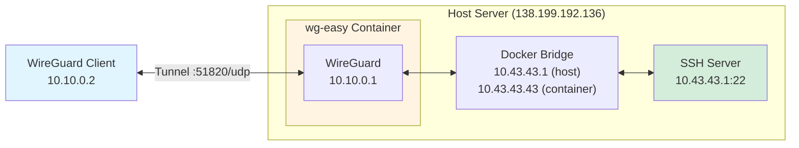

# Ansible remote servers

This is an ansible repository to setup remove servers, typically on Hetzner.

## Server creation

- Type: shared vCPU CX23 or CX22
- Networking: IPv6 only (if the home network supports IPv6) to save money
- Set your SSH Keys as default
- Use this cloud-init (see [Hetzner cloud config](https://www.google.com/url?sa=t&source=web&rct=j&opi=89978449&url=https://community.hetzner.com/tutorials/basic-cloud-config/&ved=2ahUKEwikxMremLqRAxWi1wIHHdLbKDsQFnoECA0QAQ&usg=AOvVaw16xNg-kh3TNPSPmKAsMZvv)
	- The initial `#cloud-config` comment is required!
```yaml
#cloud-config
users:
  - name: simone
    groups: users, sudo
    sudo: ALL=(ALL) ALL
    shell: /bin/bash
    ssh_authorized_keys:
      - <key here>
```
- Login as root and set the password for `simone` with `passwd simone` before disabling root login over ssh

## Setup

Install requirements:

```bash
ansible-galaxy install -r requirements.yml
```

### Initial provisioning

First run Docker and WireGuard setup:

```bash
 export ANSIBLE_BECOME_PASS=mypassword  # Add leading space to not store in history
./install greenfly --tags docker,wg_easy
```

### Configure WireGuard VPN

1. Create SSH tunnel to access wg-easy web interface:

```bash
ssh -N -L 51821:localhost:51821 simone@<server-ip>
```

2. Open browser and navigate to `http://localhost:51821`

3. Login with username `admin` and the generated password found in:
   - Server path: `/home/simone/services/wg_easy/.env`
   - Look for `INIT_PASSWORD=...`

4. Save the password in your password manager

5. Remove the `INIT_PASSWORD` variable from `/home/simone/services/wg_easy/.env` to avoid credential exposure

6. Create a new WireGuard client in the web interface

7. **Configure Allowed IPs** (for wg-easy 15.1): Add `10.43.43.1/32` to Allowed IPs in **Administrator > Admin Panel > Config** to enable SSH access over VPN (INIT_ALLOWED_IPS only supported from 15.2+)

8. Download the configuration file or scan QR code

9. Import the configuration into your WireGuard client

## WireGuard Network Architecture

### Understanding the Network Layout

The WireGuard setup uses Docker with a custom bridge network, creating three distinct network layers:

1. **VPN Client Network** (`10.10.0.0/24`): WireGuard clients get IPs from this range
   - WireGuard gateway inside container: `10.10.0.1`

2. **Docker Bridge Network** (`10.43.43.0/24` for greenfly, configurable via `wg_easy_bridge_subnet`):
   - Host's bridge gateway IP: `10.43.43.1` (automatically assigned by Docker)
   - Container IP: `10.43.43.43` (configured via `wg_easy_bridge_ip`)

3. **Public Internet**: Server's public IP (e.g., `138.199.192.136`)



**Network flow for SSH over WireGuard:**
1. Client (10.10.0.2) sends SSH traffic to 10.43.43.1
2. Traffic goes through WireGuard tunnel to wg0 interface (10.10.0.1) in container
3. Container forwards traffic (IP forwarding enabled) to Docker bridge
4. Bridge routes traffic from 10.43.43.43 to host at 10.43.43.1
5. Host's SSH server receives the connection

### SSH Access Over WireGuard

**Important:** The wg-easy container runs only WireGuard and the web UI - there is NO SSH server inside the container.

To SSH to the host server over the WireGuard VPN:

```bash
ssh simone@10.43.43.1
```

You must use the **host's Docker bridge IP** (`10.43.43.1`), NOT:
- ❌ `10.10.0.1` - This is the WireGuard gateway inside the container (no SSH server)
- ❌ `10.43.43.43` - This is the container's IP (no SSH server)
- ✅ `10.43.43.1` - This is the host's IP on the Docker bridge network (SSH server accessible)

### Split VPN Configuration

The WireGuard setup uses **split tunneling** with specific AllowedIPs to avoid routing all traffic through the server. This is important because Hetzner servers have limited monthly network traffic quotas.

**AllowedIPs configuration includes:**
- `10.43.43.1/32` - Host's Docker bridge IP for SSH access
- `10.10.0.0/24` - VPN client network
- `fd10:10:10::/64` - IPv6 VPN network
- DNS server IPs (e.g., AdGuard DNS) - Required for Android Private DNS to work before VPN is fully established

**Note for wg-easy 15.1 users:** The `INIT_ALLOWED_IPS` variable in `.env` is not yet supported in version 15.1 (will be supported from 15.2+). You must manually configure the AllowedIPs in the wg-easy web UI when creating or editing clients.

### Securing SSH Access

Once WireGuard is working and you've verified SSH access over the VPN, run the UFW role to restrict SSH to VPN-only:

```bash
 export ANSIBLE_BECOME_PASS=mypassword  # Add leading space to not store in history
./install greenfly --tags ufw
```

**⚠️ WARNING:** This will block SSH access from the public internet! Only proceed after confirming:
1. WireGuard VPN is working
2. You can SSH to `10.43.43.1` over the VPN
3. You have tested VPN connectivity

The UFW role will:
- Allow WireGuard port (51820/udp) from the internet
- Allow SSH (22/tcp) only from the Docker bridge network (WireGuard clients)
- Deny all other incoming traffic

### Full provisioning

To run all roles:

```bash
 export ANSIBLE_BECOME_PASS=mypassword  # Add leading space to not store in history
./install greenfly
```

